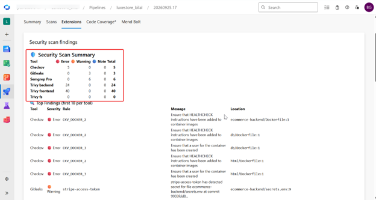
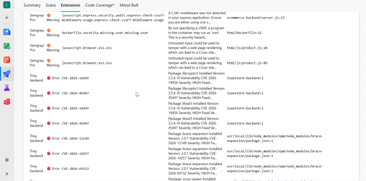
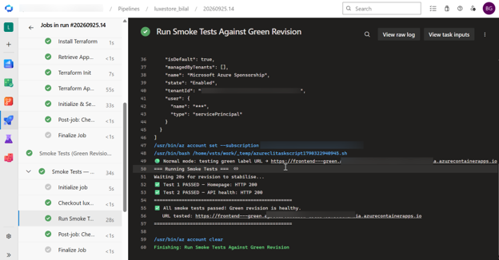
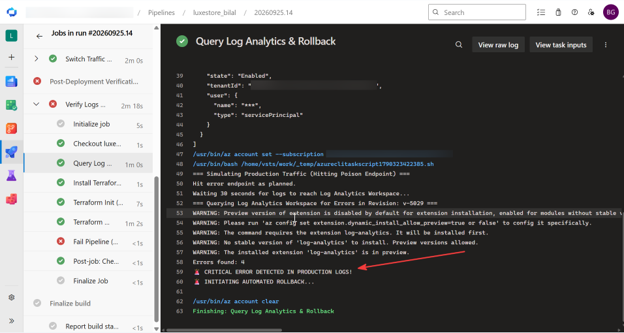

# 🛍️ LuxeStore DevSecOps & Blue/Green Deployments on Azure

 **LuxeStore Azure DevOps** repository! This project showcases a state-of-the-art **DevSecOps** pipeline and infrastructure setup for a containerized e-commerce application. It demonstrates how to implement shift-left security, zero-downtime Blue/Green deployments, and automated log-driven rollbacks using Azure Container Apps, Terraform, and Azure DevOps.

---

## 🏗️ Architecture Overview

The application is a multi-tier microservices architecture consisting of:
- **Frontend**: Containerized web interface (`/html`).
- **Backend**: Containerized API service (`/ecommerce-backend`).
- **Database**: Azure Database for MySQL Flexible Server.
- **Infrastructure**: Provisioned entirely as code (IaC) using **Terraform** (`/infra`), leveraging Azure Container Apps for scalable, serverless container execution.

---

## 🛡️ DevSecOps Pipeline

The CI/CD pipeline (`azure-pipelines.yml`) integrates security at every phase of the software development lifecycle. Before any code is deployed, it must pass a rigorous gauntlet of security gates:

1. **Secrets Scanning**: **Gitleaks** ensures no hardcoded credentials or API keys make it into the repository.
2. **SAST (Static Application Security Testing)**: **Semgrep Pro** analyzes the source code for vulnerabilities and bad practices.
3. **SCA (Software Composition Analysis)**: **Trivy (FS)** scans the repository for vulnerable open-source dependencies and license compliance issues.
4. **IaC Security**: **Checkov** validates Terraform files and Dockerfiles against security best practices and compliance benchmarks.
5. **Container Image Scanning**: After building the Docker images, **Trivy (Image)** scans them for OS-level and library vulnerabilities before pushing to Azure Container Registry (ACR).

---

## 🔄 Zero-Downtime Blue/Green Deployments

To ensure maximum availability, this project employs a **Blue/Green deployment strategy** via Azure Container Apps:

1. **Deploy Green (0% Traffic)**: The pipeline deploys the newly built image as a new "Green" revision in the background, receiving no live traffic.
2. **Smoke Tests**: Automated health checks run against the isolated Green environment.
3. **Traffic Switch (Gated)**: Upon manual approval, Azure DevOps instructs Terraform to seamlessly flip 100% of user traffic from the active "Blue" revision to the new "Green" revision.

---

## ↩️ Automated Post-Deployment Rollbacks

What happens if a bad deployment slips through? This pipeline features an automated safety net:
- Following a traffic switch, the pipeline simulates live traffic to monitor system health.
- It queries the **Azure Log Analytics Workspace** using KQL to detect spikes in `ERROR`, `Exception`, or `CrashLoopBackOff` logs.
- If anomalies are detected in the new Green revision, it automatically triggers a **Terraform rollback**, instantly reverting 100% of traffic back to the stable Blue revision—minimizing blast radius and user impact.

---

## 📸 Pipeline & Security Dashboards

*(Replace the placeholder links below with your actual screenshots)*

### 1. DevSecOps Security Scan Summary
> *Summary of aggregated SARIF security scan results.*

### 2. Smoke Tests on Green Revision
> *Smoke tests on Green Revision.*

### 3. Traffic Switch & Automated Rollback
> *The automated rollback mechanism in action.*

---

## 🚀 Getting Started

### Prerequisites
- Azure Subscription
- Azure DevOps Organization & Project

### Quick Start
1. Clone the repository.
2. Set up the required Azure DevOps variable groups (e.g., `luxestore-secrets`).
3. Create an Azure Service Connection linking your Azure Subscription.
4. Run the pipeline in Azure DevOps!
